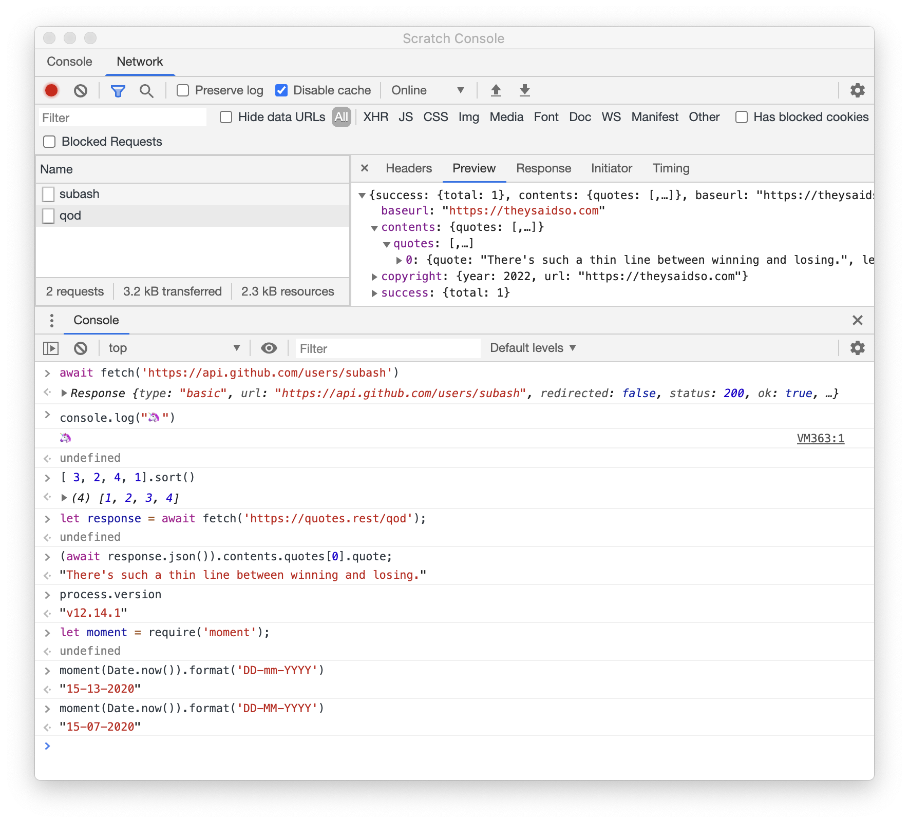

## Chrome DevTools based repl for both node.js and browser.
Play around with both browser and node js code in the same repl.

### Features
* Run both node and browser js code.
* `require` and use node modules from your home directory.
* Send fetch requests then inspect results without any CORS restrictions.

### Download
* [Windows](https://github.com/Subash/scratch-console/releases/download/1.3.0/Scratch.Console-Setup-1.3.0.exe)
* [macOS](https://github.com/Subash/scratch-console/releases/download/1.3.0/Scratch.Console-1.3.0.zip)
